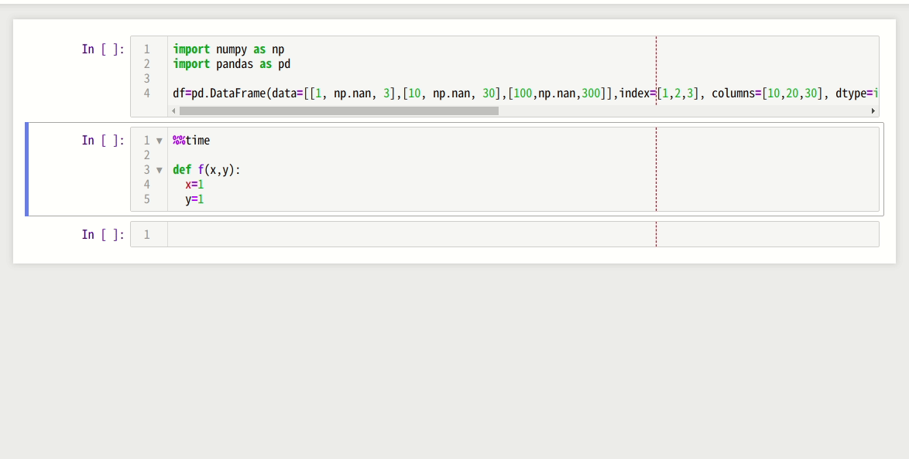

# Jupyter Black [Black formatter for Jupyter Notebook]

This extension reformats/prettifies code in a notebook's code cell by [black](https://black.readthedocs.io/en/stable/). 



**pre-requisites:** of course, you must have some of the corresponding packages installed:

```bash
pip install black [--user]
```

Then the extension provides

- a toolbar button
- a keyboard shortcut for reformatting the current code-cell (default: Ctrl-B)
- a keyboard shortcut for reformatting whole code-cells (default: Ctrl-Shift-B)

Syntax shall be correct. The extension will also point basic syntax errors. 

## Installation

If you use [jupyter-contrib-nbextensions](https://github.com/ipython-contrib/jupyter_contrib_nbextensions), proceed as usual. 

Otherwise, you can still install/try the extension from personal repo, using

```bash
jupyter nbextension install https://github.com/drillan/jupyter-black/archive/master.zip --user
jupyter nbextension enable jupyter-black-master/jupyter-black
```
